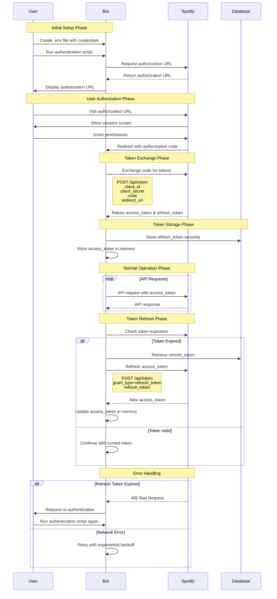

# Authentication Flow

This diagram shows the OAuth 2.0 authentication process and token management for the Spotify App Agent Template.

## Authentication Components

### 1. Initial Setup
- **Environment Variables**: Store client ID and secret in `.env` file
- **Authorization Request**: Generate authorization URL with required scopes
- **User Consent**: User grants permissions through Spotify web interface

### 2. Token Exchange
- **Authorization Code**: Exchange temporary code for access and refresh tokens
- **Token Storage**: Securely store refresh token, keep access token in memory
- **Scope Validation**: Ensure required permissions are granted

### 3. Normal Operation
- **API Requests**: Include access token in all Spotify API calls
- **Token Validation**: Check token expiration before each request
- **Error Handling**: Handle authentication errors gracefully

### 4. Token Refresh
- **Automatic Refresh**: Refresh access token when expired
- **Secure Storage**: Retrieve refresh token from secure storage
- **Memory Management**: Update access token in application memory

## Security Features

### Credential Management
- **Environment Variables**: Never hardcode credentials in source code
- **Secure Storage**: Store refresh tokens in encrypted database
- **Memory Protection**: Access tokens stored only in memory

### Token Security
- **Short-lived Access Tokens**: Access tokens expire quickly for security
- **Long-lived Refresh Tokens**: Refresh tokens for automatic renewal
- **Scope Limitation**: Request only necessary API permissions

### Error Handling
- **Graceful Degradation**: Handle authentication failures gracefully
- **Automatic Retry**: Retry failed requests with exponential backoff
- **User Notification**: Prompt user for re-authentication when needed

## Required Scopes

The application requests the following Spotify API scopes:

- **playlist-read-private**: Read private playlists
- **playlist-modify-public**: Modify public playlists
- **playlist-modify-private**: Modify private playlists
- **user-read-private**: Read user profile information
- **user-read-email**: Read user email address

## Implementation Details

### Authentication Scripts
- **get_spotify_token.py**: Automated OAuth flow with local server
- **get_spotify_token_manual.py**: Manual OAuth flow for users
- **get_spotify_token_secure.py**: Secure OAuth flow with ngrok

### Token Management
- **Automatic Refresh**: Built into Spotify client
- **Error Recovery**: Handle expired refresh tokens
- **Secure Storage**: Database encryption for refresh tokens

### Best Practices
- **Never Log Tokens**: Avoid logging sensitive authentication data
- **Regular Rotation**: Rotate credentials periodically
- **Monitor Usage**: Track API usage and rate limits
- **Error Logging**: Log authentication errors for debugging
