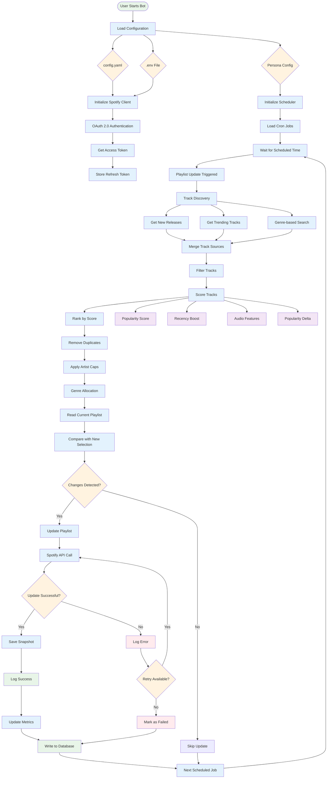

# Data Flow

This diagram illustrates the flow of data through the Spotify App Agent Template, from initial configuration to playlist updates.

## Data Flow Stages

### 1. Initialization
- **Configuration Loading**: Load settings from YAML, environment variables, and persona config
- **Authentication**: Initialize Spotify client with OAuth 2.0 credentials
- **Scheduler Setup**: Configure cron jobs for automated updates

### 2. Track Discovery
- **New Releases**: Fetch latest releases from Spotify
- **Trending Tracks**: Get popular tracks from charts
- **Genre Search**: Search for tracks by genre preferences
- **Source Merging**: Combine tracks from all sources

### 3. Track Processing
- **Filtering**: Remove tracks that don't meet criteria
- **Scoring**: Calculate scores based on popularity, recency, and features
- **Ranking**: Sort tracks by calculated scores
- **Deduplication**: Remove duplicate tracks
- **Artist Capping**: Limit tracks per artist for diversity
- **Genre Allocation**: Ensure genre diversity in final selection

### 4. Scoring Components
- **Popularity Score**: Based on Spotify popularity metric
- **Recency Boost**: Bonus for newer releases
- **Audio Features**: Energy, danceability, and other features
- **Popularity Delta**: Change in popularity over time

### 5. Update Decision
- **Database Read**: Get current playlist state
- **Comparison**: Compare new selection with current playlist
- **Change Detection**: Determine if update is needed

### 6. Playlist Update
- **API Call**: Make Spotify API request to update playlist
- **Success Handling**: Save snapshots and update metrics
- **Error Handling**: Log errors and retry if possible

### 7. Data Persistence
- **Snapshot Storage**: Save playlist state as JSON/CSV
- **Database Write**: Update SQLite database with metrics
- **Logging**: Record all operations for monitoring

## Key Data Points

### Input Data
- **Configuration**: YAML settings, environment variables
- **Spotify API**: Track metadata, popularity, audio features
- **User Preferences**: Genre preferences, scoring weights

### Processed Data
- **Track Scores**: Calculated scores for each track
- **Selection Results**: Final track selection for playlists
- **Update Decisions**: Whether updates are needed

### Output Data
- **Playlist Updates**: Modified Spotify playlists
- **Snapshots**: Historical playlist states
- **Metrics**: Performance and usage statistics
- **Logs**: Operation audit trail

## Error Handling

- **API Failures**: Retry with exponential backoff
- **Authentication Errors**: Refresh tokens automatically
- **Rate Limiting**: Respect API limits and wait
- **Data Validation**: Validate all inputs and outputs
- **Graceful Degradation**: Continue operation with partial data
