# System Architecture

This diagram shows the high-level architecture of the Spotify App Agent Template, including all major components and their interactions.

```mermaid
graph TB
    %% External Services
    subgraph "External Services"
        SPOTIFY[Spotify Web API]
        DOCKER[Docker Hub]
    end
    
    %% User Interface
    subgraph "User Interface"
        CLI[Command Line Interface]
        DASHBOARD[Dashboard Tool]
        CONFIG[Configuration Files]
    end
    
    %% Core Application
    subgraph "Core Application"
        MAIN[Main Application]
        SCHEDULER[APScheduler]
        LOGGER[Logging System]
    end
    
    %% Application Modules
    subgraph "Application Modules"
        SPOTIFY_CLIENT[Spotify Client]
        TRACK_SELECTOR[Track Selector]
        PLAYLIST_MANAGER[Playlist Manager]
    end
    
    %% Data Storage
    subgraph "Data Storage"
        SQLITE[(SQLite Database)]
        SNAPSHOTS[Snapshot Files]
        LOGS[Log Files]
    end
    
    %% Configuration
    subgraph "Configuration"
        YAML[config.yaml]
        ENV[.env File]
        PERSONA[Persona Config]
    end
    
    %% Tools and Scripts
    subgraph "Tools & Scripts"
        TEST_BOT[Test Bot]
        CREATE_PLAYLISTS[Create Playlists]
        UPDATE_ART[Update Cover Art]
        PRESEED[Preseed Playlists]
    end
    
    %% Container
    subgraph "Docker Container"
        CONTAINER[Spotify App Agent Container]
    end
    
    %% Connections
    CLI --> MAIN
    DASHBOARD --> MAIN
    CONFIG --> MAIN
    
    MAIN --> SCHEDULER
    MAIN --> LOGGER
    MAIN --> SPOTIFY_CLIENT
    MAIN --> TRACK_SELECTOR
    MAIN --> PLAYLIST_MANAGER
    
    SPOTIFY_CLIENT <--> SPOTIFY
    PLAYLIST_MANAGER <--> SPOTIFY
    
    TRACK_SELECTOR --> SQLITE
    PLAYLIST_MANAGER --> SQLITE
    LOGGER --> LOGS
    
    MAIN --> SNAPSHOTS
    
    YAML --> MAIN
    ENV --> SPOTIFY_CLIENT
    PERSONA --> PLAYLIST_MANAGER
    
    TEST_BOT --> SPOTIFY_CLIENT
    CREATE_PLAYLISTS --> SPOTIFY_CLIENT
    UPDATE_ART --> SPOTIFY_CLIENT
    PRESEED --> MAIN
    
    CONTAINER --> MAIN
    CONTAINER --> SQLITE
    CONTAINER --> SNAPSHOTS
    CONTAINER --> LOGS
    
    DOCKER --> CONTAINER
    
    %% Styling
    classDef external fill:#e1f5fe
    classDef core fill:#f3e5f5
    classDef storage fill:#e8f5e8
    classDef config fill:#fff3e0
    classDef tools fill:#fce4ec
    classDef container fill:#f1f8e9
    
    class SPOTIFY,DOCKER external
    class MAIN,SCHEDULER,LOGGER,SPOTIFY_CLIENT,TRACK_SELECTOR,PLAYLIST_MANAGER core
    class SQLITE,SNAPSHOTS,LOGS storage
    class YAML,ENV,PERSONA config
    class TEST_BOT,CREATE_PLAYLISTS,UPDATE_ART,PRESEED tools
    class CONTAINER container
```

## Component Descriptions

### External Services
- **Spotify Web API**: External service providing music data and playlist management
- **Docker Hub**: Container registry for deployment

### User Interface
- **Command Line Interface**: Makefile commands for bot management
- **Dashboard Tool**: Web-based monitoring interface
- **Configuration Files**: YAML and environment variable configuration

### Core Application
- **Main Application**: Orchestrates all bot operations
- **APScheduler**: Handles automated scheduling of playlist updates
- **Logging System**: Comprehensive logging and monitoring

### Application Modules
- **Spotify Client**: Handles API authentication and requests
- **Track Selector**: Intelligent track discovery and selection
- **Playlist Manager**: Playlist creation, updates, and management

### Data Storage
- **SQLite Database**: Persistent storage for bot state and metrics
- **Snapshot Files**: JSON/CSV snapshots of playlist states
- **Log Files**: Application logs and error tracking

### Configuration
- **config.yaml**: Main configuration file for bot settings
- **.env File**: Environment variables for credentials
- **Persona Config**: Bot identity and branding settings

### Tools & Scripts
- **Test Bot**: Connection and functionality testing
- **Create Playlists**: Automated playlist creation
- **Update Cover Art**: Playlist cover art management
- **Preseed Playlists**: Initial playlist population

### Docker Container
- **Spotify App Agent Container**: Containerized application deployment

## Key Features

- **Modular Design**: Separate components for different responsibilities
- **Containerized Deployment**: Docker-based deployment for consistency
- **Comprehensive Logging**: Full audit trail and monitoring
- **Flexible Configuration**: YAML-based configuration system
- **Security**: Environment variable-based credential management
- **Scalability**: Designed for easy scaling and customization
