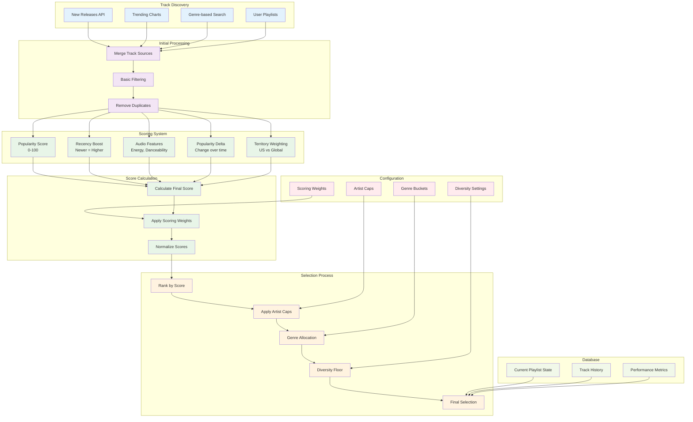

# Track Selection Process

This diagram illustrates the track selection process, showing how tracks are discovered, scored, and selected for playlists in the Spotify App Agent Template.



## Track Discovery Methods

### 1. New Releases
- **API Endpoint**: `/browse/new-releases`
- **Purpose**: Find latest releases from artists
- **Parameters**: Country, limit, offset
- **Frequency**: Daily updates

### 2. Trending Charts
- **API Endpoint**: `/playlists/37i9dQZEVXbMDoHDwVN2tF` (Global Top 50)
- **Purpose**: Get currently popular tracks
- **Parameters**: Market, limit
- **Frequency**: Real-time popularity

### 3. Genre-based Search
- **API Endpoint**: `/search`
- **Purpose**: Find tracks by specific genres
- **Parameters**: Query, type, market, limit
- **Genres**: Pop, Hip-Hop, Rock, EDM, etc.

### 4. User Playlists
- **API Endpoint**: `/users/{user_id}/playlists`
- **Purpose**: Source from user's existing playlists
- **Parameters**: User ID, limit, offset
- **Use Case**: Seeding new playlists

## Scoring Algorithm

### Scoring Components

#### 1. Popularity Score (55% weight)
- **Source**: Spotify popularity metric (0-100)
- **Calculation**: Direct value from API
- **Purpose**: Prioritize popular tracks

#### 2. Popularity Delta (30% weight)
- **Source**: Change in popularity over time
- **Calculation**: Current popularity - Previous popularity
- **Purpose**: Identify trending tracks

#### 3. Recency Boost (10% weight)
- **Source**: Track release date
- **Calculation**: Boost for newer releases
- **Purpose**: Favor recent releases

#### 4. Audio Features (5% weight)
- **Source**: Spotify audio analysis
- **Features**: Energy, danceability, valence
- **Purpose**: Match target audio profile

### Territory Weighting
- **US Popularity**: 70% weight
- **Global Popularity**: 30% weight
- **Purpose**: Balance local and global trends

## Selection Process

### 1. Artist Capping
- **Daily Playlists**: Maximum 1 track per artist
- **Weekly/Monthly**: Maximum 2 tracks per artist
- **Yearly**: Maximum 2 tracks per artist (with override)
- **Override**: Allow up to 3 tracks for dominant artists

### 2. Genre Allocation
- **Adaptive Allocation**: Popular genres get more slots
- **Diversity Floor**: Minimum 3% per genre for yearly playlists
- **Genre Buckets**: Grouped genres for better categorization

### 3. Deduplication
- **Time-based**: Remove tracks from recent playlists
- **Artist-based**: Limit tracks per artist
- **Playlist-based**: Avoid duplicate tracks within playlist

### 4. Final Selection
- **Size Limits**: Respect playlist size configuration
- **Quality Threshold**: Minimum score requirements
- **Diversity Balance**: Ensure genre variety

## Configuration Options

### Scoring Weights
```yaml
scoring:
  weights:
    popularity: 0.55
    popularity_delta: 0.30
    recency_boost: 0.10
    audio_feature_fit: 0.05
```

### Genre Configuration
```yaml
genres:
  buckets:
    Pop: ["pop", "indie pop", "dance pop"]
    HipHop: ["hip hop", "rap", "trap"]
    Rock: ["rock", "alternative rock", "indie rock"]
```

### Artist Caps
```yaml
artist_caps:
  playlist1: 1
  playlist2: 2
  playlist3: 2
  playlist4: 2
```

## Performance Optimization

### Caching
- **Track Cache**: Cache track data to reduce API calls
- **Score Cache**: Cache calculated scores
- **Genre Cache**: Cache genre classifications

### Batch Processing
- **API Batching**: Batch multiple API requests
- **Parallel Processing**: Process tracks in parallel
- **Memory Management**: Efficient memory usage

### Error Handling
- **API Failures**: Retry with exponential backoff
- **Missing Data**: Handle incomplete track information
- **Rate Limiting**: Respect API rate limits
