# Spotify Top Hits Bot - Deployment & Operations

This document provides comprehensive diagrams for deployment processes, monitoring, troubleshooting, and operational workflows using Mermaid diagrams.

## 🚀 Deployment Process

## 🔧 Troubleshooting Workflow

## 📊 Monitoring Dashboard

## 🔄 Backup & Recovery Process

## 🚨 Alert & Notification System

## 📈 Performance Monitoring

```mermaid
graph LR
    subgraph "Performance Metrics"
        RESPONSE_TIME[API Response Time<br/>Avg: 245ms<br/>P95: 890ms<br/>P99: 1.2s]
        THROUGHPUT[Requests/Second<br/>Current: 12.3<br/>Peak: 45.7<br/>Average: 18.2]
        ERROR_RATE[Error Rate<br/>Current: 0.02%<br/>Peak: 0.15%<br/>Average: 0.03%]
        RESOURCE_USAGE[Resource Usage<br/>CPU: 2.3%<br/>Memory: 25%<br/>Disk: 4.5%]
    end
    
    subgraph "Trends"
        RESPONSE_TREND[Response Time Trend<br/>📈 Increasing<br/>Last 7 days]
        THROUGHPUT_TREND[Throughput Trend<br/>📊 Stable<br/>Last 7 days]
        ERROR_TREND[Error Rate Trend<br/>📉 Decreasing<br/>Last 7 days]
        RESOURCE_TREND[Resource Trend<br/>📊 Stable<br/>Last 7 days]
    end
    
    subgraph "Alerts"
        RESPONSE_ALERT[Response Time Alert<br/>⚠️ P95 > 1s]
        ERROR_ALERT[Error Rate Alert<br/>✅ Normal < 0.1%]
        RESOURCE_ALERT[Resource Alert<br/>✅ Normal < 80%]
    end
    
    RESPONSE_TIME --> RESPONSE_TREND
    THROUGHPUT --> THROUGHPUT_TREND
    ERROR_RATE --> ERROR_TREND
    RESOURCE_USAGE --> RESOURCE_TREND
    
    RESPONSE_TREND --> RESPONSE_ALERT
    ERROR_TREND --> ERROR_ALERT
    RESOURCE_TREND --> RESOURCE_ALERT
    
    style RESPONSE_TIME fill:#e1f5fe
    style THROUGHPUT fill:#f3e5f5
    style ERROR_RATE fill:#e8f5e8
    style RESOURCE_USAGE fill:#fff3e0
    style RESPONSE_ALERT fill:#ffcdd2
    style ERROR_ALERT fill:#c8e6c9
    style RESOURCE_ALERT fill:#c8e6c9
```

## 🔍 Log Analysis Workflow

## 🛠️ Maintenance Procedures

---

## 📝 Operational Notes

### **Deployment Process**
- **Automated checks** ensure all prerequisites are met
- **Health verification** confirms successful deployment
- **Rollback procedures** available if deployment fails

### **Troubleshooting Workflow**
- **Systematic approach** to issue resolution
- **Escalation paths** for complex problems
- **Documentation** of all resolutions

### **Monitoring Dashboard**
- **Real-time status** of all system components
- **Performance metrics** for proactive management
- **Alert system** for immediate issue notification

### **Backup & Recovery**
- **Automated backups** with integrity verification
- **Multiple recovery options** for different scenarios
- **Testing procedures** to ensure recovery works

### **Alert System**
- **Multi-channel notifications** (SMS, Email, Slack)
- **Severity-based response** times
- **Escalation procedures** for critical issues

### **Performance Monitoring**
- **Key metrics** tracked in real-time
- **Trend analysis** for capacity planning
- **Proactive alerts** before issues occur

### **Log Analysis**
- **Structured approach** to log investigation
- **Pattern recognition** for common issues
- **Documentation** of findings and solutions

### **Maintenance Schedule**
- **Regular intervals** for different maintenance types
- **Proactive maintenance** prevents issues
- **Comprehensive coverage** of all system aspects

These operational diagrams provide a complete framework for:
- **Deployment management**
- **Issue resolution**
- **System monitoring**
- **Maintenance planning**
- **Disaster recovery**
- **Performance optimization**
