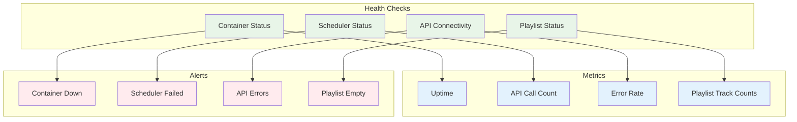
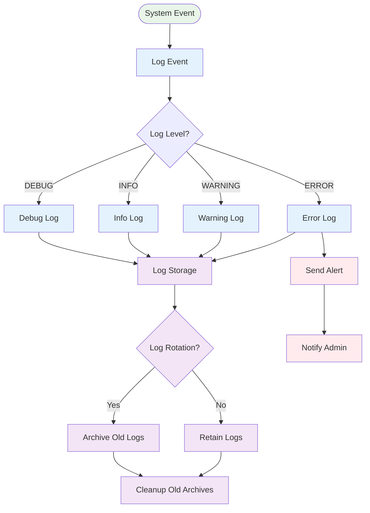
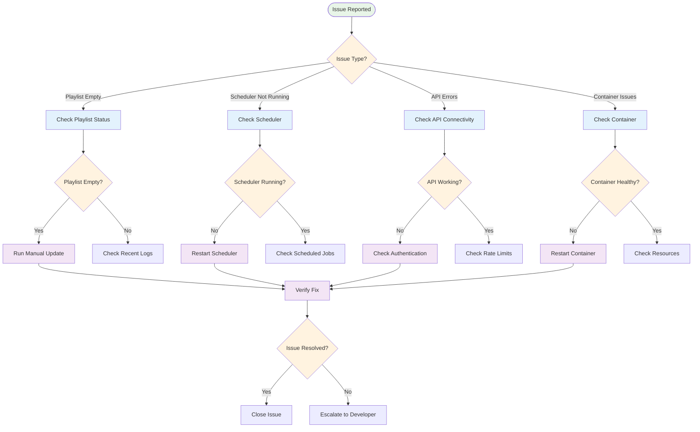
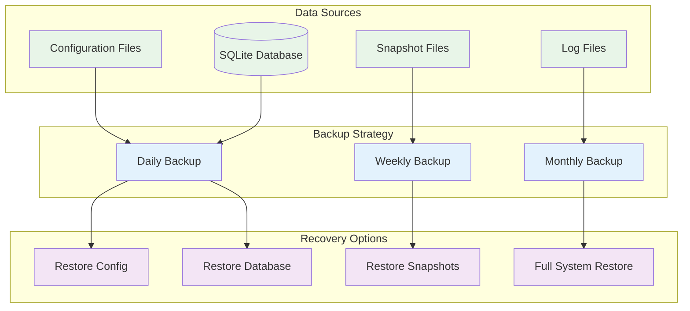
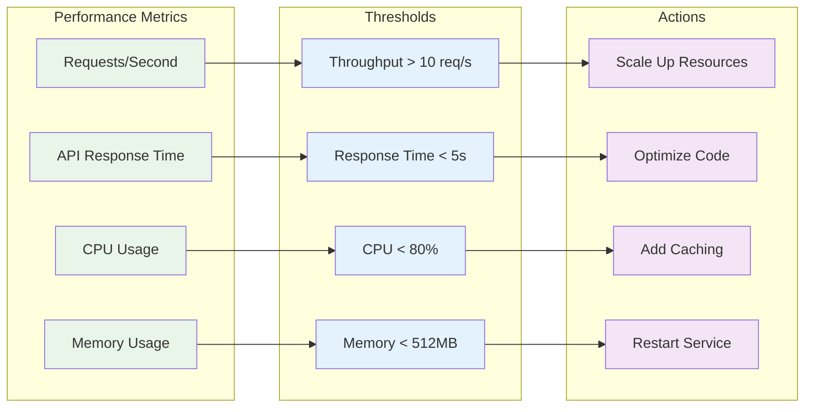

# Monitoring and Operations

## System Health Monitoring

```mermaid
graph TB
    subgraph "Health Checks"
        CONTAINER[Container Status]
        SCHEDULER[Scheduler Status]
        API[API Connectivity]
        PLAYLISTS[Playlist Status]
    end
    
    subgraph "Metrics"
        UPTIME[Uptime]
        API_CALLS[API Call Count]
        ERROR_RATE[Error Rate]
        PLAYLIST_COUNTS[Playlist Track Counts]
    end
    
    subgraph "Alerts"
        CONTAINER_DOWN[Container Down]
        SCHEDULER_FAILED[Scheduler Failed]
        API_ERRORS[API Errors]
        PLAYLIST_EMPTY[Playlist Empty]
    end
    
    CONTAINER --> UPTIME
    SCHEDULER --> API_CALLS
    API --> ERROR_RATE
    PLAYLISTS --> PLAYLIST_COUNTS
    
    CONTAINER --> CONTAINER_DOWN
    SCHEDULER --> SCHEDULER_FAILED
    API --> API_ERRORS
    PLAYLISTS --> PLAYLIST_EMPTY
    
    classDef health fill:#e8f5e8
    classDef metrics fill:#e3f2fd
    classDef alerts fill:#ffebee
    
    class CONTAINER,SCHEDULER,API,PLAYLISTS health
    class UPTIME,API_CALLS,ERROR_RATE,PLAYLIST_COUNTS metrics
    class CONTAINER_DOWN,SCHEDULER_FAILED,API_ERRORS,PLAYLIST_EMPTY alerts
```

## Logging and Debugging Flow

```mermaid
flowchart TD
    EVENT([System Event]) --> LOG[Log Event]
    LOG --> LEVEL{Log Level?}
    
    LEVEL -->|DEBUG| DEBUG_LOG[Debug Log]
    LEVEL -->|INFO| INFO_LOG[Info Log]
    LEVEL -->|WARNING| WARNING_LOG[Warning Log]
    LEVEL -->|ERROR| ERROR_LOG[Error Log]
    
    DEBUG_LOG --> STORAGE[Log Storage]
    INFO_LOG --> STORAGE
    WARNING_LOG --> STORAGE
    ERROR_LOG --> STORAGE
    
    STORAGE --> ROTATION{Log Rotation?}
    ROTATION -->|Yes| ARCHIVE[Archive Old Logs]
    ROTATION -->|No| RETAIN[Retain Logs]
    
    ARCHIVE --> CLEANUP[Cleanup Old Archives]
    RETAIN --> CLEANUP
    
    ERROR_LOG --> ALERT[Send Alert]
    ALERT --> NOTIFY[Notify Admin]
    
    classDef event fill:#e8f5e8
    classDef log fill:#e3f2fd
    classDef storage fill:#f3e5f5
    classDef alert fill:#ffebee
    
    class EVENT event
    class LOG,DEBUG_LOG,INFO_LOG,WARNING_LOG,ERROR_LOG log
    class STORAGE,ROTATION,ARCHIVE,RETAIN,CLEANUP storage
    class ALERT,NOTIFY alert
```

## Troubleshooting Decision Tree

```mermaid
flowchart TD
    ISSUE([Issue Reported]) --> TYPE{Issue Type?}
    
    TYPE -->|Playlist Empty| CHECK_PLAYLIST[Check Playlist Status]
    TYPE -->|Scheduler Not Running| CHECK_SCHEDULER[Check Scheduler]
    TYPE -->|API Errors| CHECK_API[Check API Connectivity]
    TYPE -->|Container Issues| CHECK_CONTAINER[Check Container]
    
    CHECK_PLAYLIST --> PLAYLIST_EMPTY{Playlist Empty?}
    CHECK_SCHEDULER --> SCHEDULER_RUNNING{Scheduler Running?}
    CHECK_API --> API_WORKING{API Working?}
    CHECK_CONTAINER --> CONTAINER_HEALTHY{Container Healthy?}
    
    PLAYLIST_EMPTY -->|Yes| MANUAL_UPDATE[Run Manual Update]
    PLAYLIST_EMPTY -->|No| CHECK_LOGS[Check Recent Logs]
    
    SCHEDULER_RUNNING -->|No| RESTART_SCHEDULER[Restart Scheduler]
    SCHEDULER_RUNNING -->|Yes| CHECK_JOBS[Check Scheduled Jobs]
    
    API_WORKING -->|No| CHECK_AUTH[Check Authentication]
    API_WORKING -->|Yes| CHECK_RATE_LIMIT[Check Rate Limits]
    
    CONTAINER_HEALTHY -->|No| RESTART_CONTAINER[Restart Container]
    CONTAINER_HEALTHY -->|Yes| CHECK_RESOURCES[Check Resources]
    
    MANUAL_UPDATE --> VERIFY[Verify Fix]
    RESTART_SCHEDULER --> VERIFY
    CHECK_AUTH --> VERIFY
    RESTART_CONTAINER --> VERIFY
    
    VERIFY --> RESOLVED{Issue Resolved?}
    RESOLVED -->|Yes| CLOSE[Close Issue]
    RESOLVED -->|No| ESCALATE[Escalate to Developer]
    
    classDef issue fill:#e8f5e8
    classDef check fill:#e3f2fd
    classDef action fill:#f3e5f5
    classDef decision fill:#fff3e0
    
    class ISSUE issue
    class CHECK_PLAYLIST,CHECK_SCHEDULER,CHECK_API,CHECK_CONTAINER check
    class MANUAL_UPDATE,RESTART_SCHEDULER,CHECK_AUTH,RESTART_CONTAINER,VERIFY action
    class TYPE,PLAYLIST_EMPTY,SCHEDULER_RUNNING,API_WORKING,CONTAINER_HEALTHY,RESOLVED decision
```

## Backup and Recovery Strategy

```mermaid
graph TB
    subgraph "Data Sources"
        CONFIG[Configuration Files]
        DATABASE[(SQLite Database)]
        SNAPSHOTS[Snapshot Files]
        LOGS[Log Files]
    end
    
    subgraph "Backup Strategy"
        DAILY_BACKUP[Daily Backup]
        WEEKLY_BACKUP[Weekly Backup]
        MONTHLY_BACKUP[Monthly Backup]
    end
    
    subgraph "Recovery Options"
        CONFIG_RESTORE[Restore Config]
        DB_RESTORE[Restore Database]
        SNAPSHOT_RESTORE[Restore Snapshots]
        FULL_RESTORE[Full System Restore]
    end
    
    CONFIG --> DAILY_BACKUP
    DATABASE --> DAILY_BACKUP
    SNAPSHOTS --> WEEKLY_BACKUP
    LOGS --> MONTHLY_BACKUP
    
    DAILY_BACKUP --> CONFIG_RESTORE
    DAILY_BACKUP --> DB_RESTORE
    WEEKLY_BACKUP --> SNAPSHOT_RESTORE
    MONTHLY_BACKUP --> FULL_RESTORE
    
    classDef source fill:#e8f5e8
    classDef backup fill:#e3f2fd
    classDef recovery fill:#f3e5f5
    
    class CONFIG,DATABASE,SNAPSHOTS,LOGS source
    class DAILY_BACKUP,WEEKLY_BACKUP,MONTHLY_BACKUP backup
    class CONFIG_RESTORE,DB_RESTORE,SNAPSHOT_RESTORE,FULL_RESTORE recovery
```

## Performance Monitoring

```mermaid
graph LR
    subgraph "Performance Metrics"
        RESPONSE_TIME[API Response Time]
        THROUGHPUT[Requests/Second]
        MEMORY_USAGE[Memory Usage]
        CPU_USAGE[CPU Usage]
    end
    
    subgraph "Thresholds"
        RESPONSE_THRESHOLD[Response Time < 5s]
        THROUGHPUT_THRESHOLD[Throughput > 10 req/s]
        MEMORY_THRESHOLD[Memory < 512MB]
        CPU_THRESHOLD[CPU < 80%]
    end
    
    subgraph "Actions"
        SCALE_UP[Scale Up Resources]
        OPTIMIZE[Optimize Code]
        CACHE[Add Caching]
        RESTART[Restart Service]
    end
    
    RESPONSE_TIME --> RESPONSE_THRESHOLD
    THROUGHPUT --> THROUGHPUT_THRESHOLD
    MEMORY_USAGE --> MEMORY_THRESHOLD
    CPU_USAGE --> CPU_THRESHOLD
    
    RESPONSE_THRESHOLD --> OPTIMIZE
    THROUGHPUT_THRESHOLD --> SCALE_UP
    MEMORY_THRESHOLD --> RESTART
    CPU_THRESHOLD --> CACHE
    
    classDef metric fill:#e8f5e8
    classDef threshold fill:#e3f2fd
    classDef action fill:#f3e5f5
    
    class RESPONSE_TIME,THROUGHPUT,MEMORY_USAGE,CPU_USAGE metric
    class RESPONSE_THRESHOLD,THROUGHPUT_THRESHOLD,MEMORY_THRESHOLD,CPU_THRESHOLD threshold
    class SCALE_UP,OPTIMIZE,CACHE,RESTART action
```
