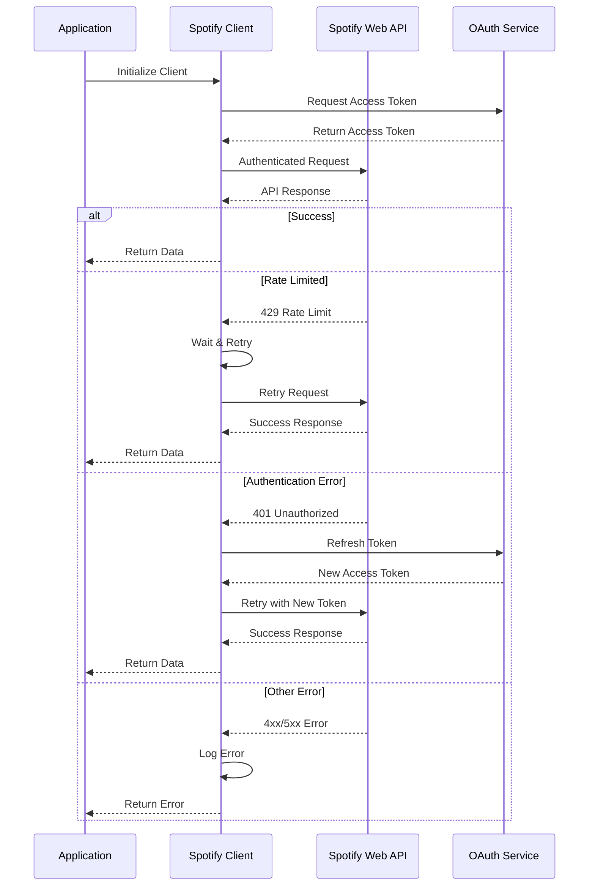
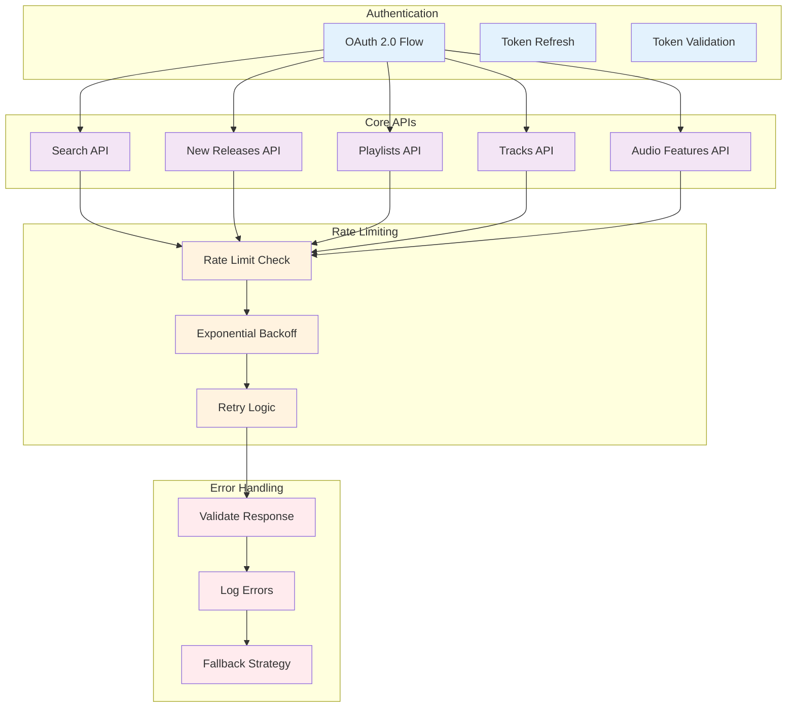
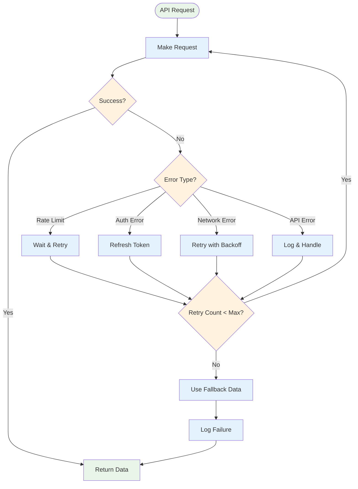
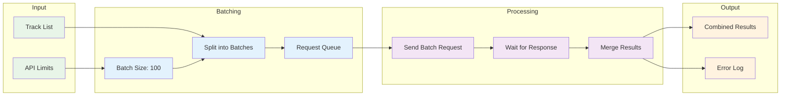

# API Integration and Error Handling

## Spotify API Integration Flow



## API Request Patterns



## Error Recovery Strategy



## Batch Processing Strategy



## API Endpoint Usage

```mermaid
graph TB
    subgraph "Authentication"
        TOKEN[Access Token Management]
        REFRESH[Token Refresh Logic]
    end
    
    subgraph "Discovery"
        SEARCH[/search]
        NEW_RELEASES[/browse/new-releases]
        FEATURED[/browse/featured-playlists]
    end
    
    subgraph "Playlist Management"
        GET_PLAYLIST[/playlists/{id}]
        CREATE_PLAYLIST[POST /playlists]
        UPDATE_PLAYLIST[PUT /playlists/{id}]
        ADD_TRACKS[POST /playlists/{id}/tracks]
        REMOVE_TRACKS[DELETE /playlists/{id}/tracks]
    end
    
    subgraph "Track Information"
        GET_TRACK[/tracks/{id}]
        GET_AUDIO_FEATURES[/audio-features]
        GET_ANALYSIS[/audio-analysis/{id}]
    end
    
    TOKEN --> SEARCH
    TOKEN --> NEW_RELEASES
    TOKEN --> FEATURED
    TOKEN --> GET_PLAYLIST
    TOKEN --> CREATE_PLAYLIST
    TOKEN --> UPDATE_PLAYLIST
    TOKEN --> ADD_TRACKS
    TOKEN --> REMOVE_TRACKS
    TOKEN --> GET_TRACK
    TOKEN --> GET_AUDIO_FEATURES
    TOKEN --> GET_ANALYSIS
    
    classDef auth fill:#e3f2fd
    classDef discovery fill:#f3e5f5
    classDef playlist fill:#e8f5e8
    classDef track fill:#fff3e0
    
    class TOKEN,REFRESH auth
    class SEARCH,NEW_RELEASES,FEATURED discovery
    class GET_PLAYLIST,CREATE_PLAYLIST,UPDATE_PLAYLIST,ADD_TRACKS,REMOVE_TRACKS playlist
    class GET_TRACK,GET_AUDIO_FEATURES,GET_ANALYSIS track
```
